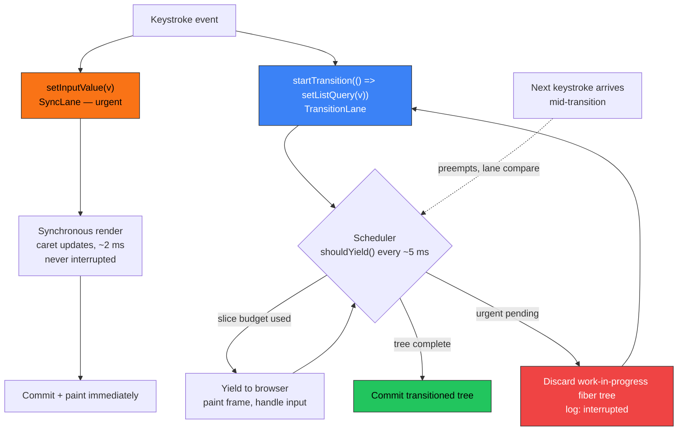

# CRUP — Concurrent Rendering & Update Prioritization Lab

A dependency-free React 18 lab that makes concurrent rendering **visible**: the same 12,000-item search implemented with and without `useTransition`, live latency/FPS meters, a priority timeline of every update (including the ones React interrupts and throws away), and a flamechart reconstructed from render-phase timestamps.


## Table of Contents

- [Overview](#overview)
- [Mental Model](#mental-model)
- [Repository Structure](#repository-structure)
- [Core Concepts](#core-concepts)
  - [1. Why React 18 introduced concurrent rendering](#1-why-react-18-introduced-concurrent-rendering)
  - [2. Lanes: how React prioritizes updates](#2-lanes-how-react-prioritizes-updates)
  - [3. `useTransition`: split-state pattern](#3-usetransition-split-state-pattern)
  - [4. `useDeferredValue`: deferring a value you don't set](#4-usedeferredvalue-deferring-a-value-you-dont-set)
  - [5. Instrumentation: watching the scheduler with `useSyncExternalStore`](#5-instrumentation-watching-the-scheduler-with-usesyncexternalstore)
  - [6. Suspense and automatic batching](#6-suspense-and-automatic-batching)
- [Measured Results](#measured-results)
- [Getting Started](#getting-started)
- [Where This Fits in Modern React](#where-this-fits-in-modern-react)
- [Self-Check Questions](#self-check-questions)
- [Further Reading / Related Repos](#further-reading--related-repos)
- [License](#license)

## Overview

Before React 18, rendering was **synchronous and uninterruptible**: once React started an update it ran to completion, however long that took, holding the one thread that also handles clicks, keystrokes, and 60fps paint deadlines hostage. React 18's concurrent renderer changes the *mechanics* of rendering — chunked into ~5 ms time slices, interruptible mid-render, and consistent (the screen only ever shows fully-committed trees) — but only for updates you explicitly mark as non-urgent with `startTransition` or `useDeferredValue`. Everything else stays urgent and synchronous by default, which is exactly why React 18 was an adoptable, non-breaking upgrade.

This repository is a working lab, not a slideshow: `src/blocking/BlockingSearch.jsx` and `src/concurrent/ConcurrentSearch.jsx` run the identical 12,000-item filter over identical per-row cost, one urgent, one transitioned, with live meters proving the difference in your own browser. A companion cheat sheet, [`CONCURRENT_CHEATSHEET.md`](./CONCURRENT_CHEATSHEET.md), distills the same material into a fast reference for `useTransition` / `useDeferredValue` patterns and pitfalls.

## Mental Model

React 18 schedules pending work using **lanes** — a 31-bit priority bitmask. This lab collapses that model into three observable buckets, and the whole UI (Section 4, `PriorityTimeline` + `Flamechart`) exists to make the two governing rules visible as you type:

1. **Higher-priority lanes always render first.** Pending urgent work preempts pending transition work.
2. **Lower-lane work-in-progress is disposable.** If an urgent update lands mid-transition-render, React discards the half-built fiber tree and restarts later with the freshest state — the user never waits for a result they've already typed past.



| Lane (lab name) | Real examples | Scheduling behavior |
|---|---|---|
| **urgent** | typing, clicks, key presses (discrete events) | rendered synchronously, before the browser may paint; never interrupted |
| **transition** | anything inside `startTransition` | time-sliced, interruptible, abandonable, batched together |
| **deferred** | the catch-up render of `useDeferredValue` | same low-priority pool as transitions |

## Repository Structure

```
CRUP/
├── index.html                       Vite entry
├── vite.config.js
├── scripts/measure.mjs              headless-Chromium harness that scrapes the
│                                     app's own data-* attributes for real numbers
├── CONCURRENT_CHEATSHEET.md         fast reference: patterns, pitfalls, vocabulary
└── src/
    ├── App.jsx                      composes all four sections + guided tour comment
    ├── main.jsx                     createRoot bootstrap
    ├── blocking/
    │   └── BlockingSearch.jsx       Section 1 — pre-concurrent behavior, all urgent
    ├── concurrent/
    │   ├── ConcurrentSearch.jsx     Section 2 — useTransition split-state search
    │   ├── DeferredValueDemo.jsx    Section 3 — useDeferredValue + expensive chart
    │   └── TransitionDemo.jsx       Section 3b — transition-wrapped tab navigation
    ├── visualization/
    │   ├── PriorityTimeline.jsx     Section 4 — urgent/transition/deferred swimlanes
    │   ├── Flamechart.jsx           time-slicing reconstructed from render samples
    │   ├── LatencyMeter.jsx         keystroke → committed-frame latency
    │   └── HealthBar.jsx            live FPS + main-thread heartbeat
    ├── hooks/                       instrumentation built on React 18 primitives
    │   ├── perfLog.js               update log, an external store read via useSyncExternalStore
    │   ├── latencyStore.js          input-timestamp → commit-timestamp measurement
    │   └── useFps.js                requestAnimationFrame frame-rate monitor
    └── shared/
        ├── ItemList.jsx             the memoized 250-row list both searches render
        ├── burn.js                  deterministic CPU-burn helper (simulates expensive work)
        └── data.js                  the 12,000-item dataset (ITEM_COUNT)
```

Every concurrent pattern in the source carries a comment block explaining why the pattern exists, what problem it solves, when to use it, and what it costs — the code itself is the primary documentation; this README is the map.

## Core Concepts

### 1. Why React 18 introduced concurrent rendering

Section 1 (`BlockingSearch.jsx`) is the pre-18 world in miniature: one state variable drives both the input box and 250 expensive rows, so every keystroke pays the full ~200 ms render cost before the browser can paint the caret. Concurrent rendering doesn't make that work cheaper — it changes *when* React is allowed to do it, by chunking the render into small units of work and checking (`shouldYield()`, roughly every 5 ms) whether to hand the thread back to the browser.

### 2. Lanes: how React prioritizes updates

`ConcurrentSearch.jsx` demonstrates the two rules diagrammed above directly in its instrumentation:

```jsx
// src/concurrent/ConcurrentSearch.jsx
function handleChange(event) {
  const value = event.target.value;

  // 1) URGENT: the input box must reflect the keystroke immediately.
  urgentUpdateRef.current = beginUpdate(`type "${value}"`, 'urgent', 'concurrent');
  setInputValue(value);

  // 2) A previous transition render that hasn't committed is interrupted here.
  if (transitionUpdateRef.current != null) {
    interruptUpdate(transitionUpdateRef.current);
  }

  // 3) TRANSITION: the expensive list render is explicitly non-urgent.
  transitionUpdateRef.current = beginUpdate(`filter "${value}" + render list`, 'transition', 'concurrent');
  startTransition(() => {
    setListQuery(value);
  });
}
```

Typing a five-character burst typically commits only the *last* transition — the rest are logged as interrupted in the Priority Timeline (Section 4), a direct, on-screen proof that non-urgent work is disposable.

### 3. `useTransition`: split-state pattern

The pattern is **one event, two updates, two priorities**: `inputValue` (urgent, cheap, drives the box) and `listQuery` (transition, drives the expensive subtree). Two requirements make it work, both enforced in the source:

- The expensive subtree (`MemoItemList` in `src/shared/ItemList.jsx`) **must be memoized** — otherwise the urgent render drags it along anyway and the transition buys nothing.
- `startTransition`'s callback must be called synchronously — React tags updates scheduled *during* that call as low-priority; anything scheduled after an `await` inside it (React 18 semantics) falls outside the transition.

### 4. `useDeferredValue`: deferring a value you don't set

`useTransition` wraps a setter you own. `DeferredValueDemo.jsx` shows the mirror-image tool for when you only *receive* a value:

```jsx
// src/concurrent/DeferredValueDemo.jsx
const deferredText = useDeferredValue(text);
const chartValue = deferOn ? deferredText : text;
const isStale = deferOn && deferredText !== text;
```

```jsx
const ExpensiveChart = memo(function ExpensiveChart({ value, probeRef }) {
  const bars = useMemo(() => computeBars(value, probeRef), [value, probeRef]);
  // ...
});
```

Under the hood, when `text` changes React renders **twice**: an urgent render where `deferredText` still holds the old value (the memoized `ExpensiveChart` bails out — cheap, instant), then a low-priority catch-up render where `deferredText` moves to match — time-sliced and abandoned if `text` changes again first. The demo's toggle makes the cost tangible: deferral ON ≈ 6 ms keystrokes, OFF ≈ 114 ms.

### 5. Instrumentation: watching the scheduler with `useSyncExternalStore`

The entire observability layer (`PriorityTimeline`, `Flamechart`, `HealthBar`) has to watch updates happening in *other* component trees without participating in their renders — reading through props or context would itself change the timings being measured. `perfLog.js` solves this with a plain external store:

```js
// src/hooks/perfLog.js
export function useUpdateLog() {
  useSyncExternalStore(subscribe, () => store.version);
  return store.entries;
}
```

`useSyncExternalStore` is the React 18 primitive built exactly for this: reading external mutable state safely under a concurrent renderer, where an interrupted render could otherwise let two components observe different versions of the same store within one render pass (**tearing**). `beginUpdate` / `endUpdate` / `interruptUpdate` write to the store from inside the demo components; `recordRenderSample` captures `performance.now()` inside the list's render loop so `Flamechart.jsx` can reconstruct time-slicing purely from the gaps between samples — a gap is React yielding to the browser mid-render.

### 6. Suspense and automatic batching

Two more 18-era mechanics ride the same scheduler and are covered in [`CONCURRENT_CHEATSHEET.md`](./CONCURRENT_CHEATSHEET.md): **Suspense** integration (non-blocking fallbacks, transitions that suspend without unmounting visible content, selective hydration prioritizing the boundary the user is touching) and **automatic batching** (all `setState` calls in one task — timers, promises, native handlers included — collapse into a single render under `createRoot`, not just handlers as in React 17). This lab stays CPU-bound and dependency-free by design, so neither has a dedicated demo section, but the scheduling model observed in Sections 1–4 (urgent first, background interruptible) is the exact model both features build on.

## Measured Results

Collected with this repo's `scripts/measure.mjs` (headless Chromium, production build, 5 keystrokes at ~120 ms intervals). Reproduce it yourself — absolute numbers vary by machine, the *ratio* is the lesson:

| Metric | Blocking (Section 1) | Concurrent (Section 2) |
|---|---|---|
| Keystroke → next frame, average | 210 ms | 6.8 ms (≈ 31× better) |
| Minimum FPS while typing | 28 fps | 60 fps |
| Committed render shape (flamechart) | 1 chunk, 190 ms solid | 19 chunks, longest 15.9 ms |
| Transitions interrupted in a 5-key burst | n/a | 3 of 5 abandoned before commit |
| `useDeferredValue` demo | OFF: 113.8 ms avg keystroke | ON: 5.6 ms avg keystroke |

Total CPU work does **not** decrease — the concurrent search's final transition often spends *longer* in wall-clock time because it keeps yielding. Concurrent rendering is a scheduler, not an optimizer: users don't feel total work, they feel when the thread is available to them.

## Getting Started

```bash
npm install
npm run dev       # start Vite, open the printed URL
npm run build     # production build (for accurate measurements)
npm run preview   # serve the production build
```

To reproduce the measurement table above:

```bash
npm run build && npm run preview &          # serve on :4173
npm i --no-save playwright-core
PW_CHROMIUM=/path/to/chrome node scripts/measure.mjs
```

## Where This Fits in Modern React

The lane-based scheduler this lab visualizes is also the foundation the **React Compiler** and Server Components build on. The compiler automates the `memo()` / `useCallback` discipline this lab requires by hand (`MemoItemList`, `ExpensiveChart`) — but it optimizes *whether* a component re-renders, not *when* React is allowed to render it, so `useTransition` and `useDeferredValue` remain the tools for update prioritization even in a fully compiled app. Suspense-based streaming and RSC payloads are delivered and hydrated through the same lane machinery: a transition that suspends is what lets React keep showing the old screen instead of a fallback flash, and selective hydration is update prioritization applied to hydration instead of client-side re-renders.

## Self-Check Questions

<details>
<summary>A colleague says "startTransition makes the filtering faster." What actually changed?</summary>

Nothing got faster — the same components render with the same cost (arguably slightly more, since interrupted renders are thrown away). What changed is scheduling: the expensive render moved off the urgent path into ~5 ms interruptible slices. The *urgent* update's latency dropped from ~210 ms to ~7 ms; the background result arrives when it arrives.
</details>

<details>
<summary>Why does the concurrent search need memo() on the list?</summary>

Without `memo`, the urgent keystroke render would re-render the 250 slow rows during the urgent pass itself — synchronously blocking again, because a parent render re-renders children by default. `memo` lets the urgent pass bail out (the `query` prop hasn't changed yet), so only the low-priority transition render pays the list's cost.
</details>

<details>
<summary>When do you reach for useDeferredValue instead of useTransition?</summary>

When you don't control the setter. `useTransition` wraps code that *sets* state — yours to call. `useDeferredValue` wraps a *value you receive* (prop, context, external-store result) and produces a lagging copy that updates at low priority. Same lane, same interruption semantics, opposite end of the data flow.
</details>

More self-check material, plus a full patterns/pitfalls reference, lives in [`CONCURRENT_CHEATSHEET.md`](./CONCURRENT_CHEATSHEET.md).

## Further Reading / Related Repos

This repository is part of a series of focused, expert-level React labs by [Cristian Sifuentes](https://github.com/CristianSifuentes):

- [ACHooks](https://github.com/CristianSifuentes/ACHooks) — custom hooks & composable logic
- [CRUP](https://github.com/CristianSifuentes/CRUP) — concurrent rendering & update prioritization (this repo)
- [POptimizationCodeSplitting-](https://github.com/CristianSifuentes/POptimizationCodeSplitting-) — memoization, code splitting, lazy loading, Web Vitals
- [RCP](https://github.com/CristianSifuentes/RCP)
- [ILGState-](https://github.com/CristianSifuentes/ILGState-)
- [ATypeScript](https://github.com/CristianSifuentes/ATypeScript)
- [SAPatterns](https://github.com/CristianSifuentes/SAPatterns)
- [tsconfig_](https://github.com/CristianSifuentes/tsconfig_)
- [rxt-mastery_](https://github.com/CristianSifuentes/rxt-mastery_)
- [React-State-Data-Management](https://github.com/CristianSifuentes/React-State-Data-Management)
- [Architectural-Server-Side-Paradigms](https://github.com/CristianSifuentes/Architectural-Server-Side-Paradigms)
- [React-Essential-2026-Skills](https://github.com/CristianSifuentes/React-Essential-2026-Skills)
- [React-Advanced-Patterns-Performance](https://github.com/CristianSifuentes/React-Advanced-Patterns-Performance)
- [agentReact-](https://github.com/CristianSifuentes/agentReact-)
- [_ReactHooks](https://github.com/CristianSifuentes/_ReactHooks)
- [_PropDrillingReact](https://github.com/CristianSifuentes/_PropDrillingReact)
- [ReactAdvancedConceptsStudio_](https://github.com/CristianSifuentes/ReactAdvancedConceptsStudio_)

## License

Apache-2.0 (see [LICENSE](./LICENSE)).
